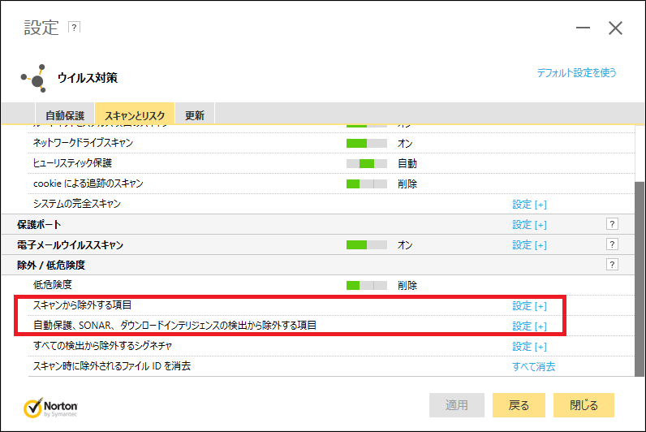

# bmovt: Boot Movie Maker


レトロコンピュータのブート画面っぽい動画を作るプログラム。

[README English Ver.](README-EN.md)

## はじめ

[S-knife](https://commons.nicovideo.jp/users/1746455) 様の[コンピュータのブート画面っぽいもの（エフェクトなし_v1）](https://commons.nicovideo.jp/material/nc117696)を参考にさせていただきました。

略儀ながら、ここに感謝の意を表します。

## 概要

[](https://www.youtube.com/watch?v=lhHvjWNb8AA)

レトロパソコンの起動時の文字が流れる、あの感じの動画を作るプログラムです。

## デモ


## 使い方

1. [Release](https://github.com/DriCro6663/bmovt/releases) からダウンロードして圧縮ファイルを解凍してください。
2. 解凍したフォルダの [./config/config.yaml](./config/config.yaml) を確認・編集してください。

    ```yaml:config.yaml
    output_path: "./boot.mp4"                     # 動画の出力ディレクトリ/動画名.mp4
    font_path: "./res/Myrica/Myrica.TTC"          # フォントのパス
    width: 1920                                   # 解像度ヨコ
    height: 1080                                  # 解像度タテ
    fps: 60                                       # FPS
    fourcc: "mp4a"                                # 動画作成時のコーデック: ../tests/fourcc_tag-mp4.txt を参照
    crf: 16                                       # 動画圧縮プロパティ: 0(品質：良, サイズ：大) < crf < 64(品質：悪, サイズ：小)
    separator: !!python/str "=+\n+"               # 区切り文字
    bg_color: !!python/tuple [0,0,0,255]          # バックグラウンドの色: tuple(r, g, b, a)
    font_color: !!python/tuple [255,255,255,255]  # フォントの色: tuple(r, g, b, a)
    font_size: 32                                 # テキストサイズ: pixels: https://www.linesmix.com/fonts.html
    spacing: 4                                    # テキストの行間: pixels
    ```

3. 解凍したフォルダの [./res](./res) フォルダに移動してください。
4. [loading.txt](./res/loading_text.txt) を編集してください。

    ```python:loading.txt
    {
        # key: value, 
        0: [" "], 
        1: [" ", "."],
        2: ["/", "-", "\\"], 
        3: ["Loading", "Loading.", "Loading..", "Loading..."],
    }
    ```

5. [boot_text.txt](./res/boot_text.txt) を編集してください。

    ```txt:boot_text
    一行目　　：表示する際の設定
    二行目以降：表示するテキスト
    
    LOADING: ローディングの設定
        - TYPE      : ローディングの表示タイプ
                      loading.txt の key を入力
                      ローディングを使用しない場合、NONE を入力
        - TIME      : ローディングの時間
        - INTERVAL  : ローディング文字の表示間隔
        - UNIT      : TIME, INTERVAL の単位
                      "SEC" or "FRAME" を入力
    
    SHOW: 表示テキストの設定
        - TYPE      : テキストの表示タイプ
            - MOMENT    : 瞬時
                          1 frame で全て表示
            - GRADUALLY : 徐々
                          表示される文字数：文字数 / (TIME / INTERVAL)
            - L_BY_L    : 行ごとに文字表示
                          TIME, INTERVAL の順に数字を読込、処理
                          TIME != 0: INTERVAL = TIME / 改行数 
                          INTERVAL != 0: TIME = INTERVAL * 改行数
            - F_BY_F    : フレームごとに一文字表示
        - TIME      : 表示時間
        - INTERVAL  : 表示間隔
        - UNIT      : TIME, INTERVAL の単位
                      "SEC" or "FRAME" を入力
    ```

6. プログラムを実行して、動画を作成してください。

## 環境

* Windows 10
* Python 3.10
* conda 22.9.0

ソースコードを編集したい方は、下記を参考に環境を構築してください。

<details>
<summary>こちらをクリックしてください</summary>

### 仮想環境構築

```bash:Anaconda_Ver.
conda create -n bmovt --file bmovt.yaml
```

プロキシ設定が必要な方は、下記を参考に設定してください。

```bash:Proxy
# windows
# if you need to use proxy, please set proxy setting.
set HTTP_PROXY=http://<userid>:<password>@<server-address>:<port>
set HTTPS_PROXY=http://<userid>:<password>@<server-address>:<port>

# example
set HTTP_PROXY=http://proxy.example.com:8080
set HTTPS_PROXY=http://proxy.example.com:8080

# check proxy
echo %HTTP_PROXY%
echo %HTTPS_PROXY%
```

### 実行

```bash
python -m bmovt
```

### py -> exe

Nuitka で実行ファイルを作ると、クッソ時間が掛かります。（1 ~ 2 時間）

また、Nuitka は GCC[MinGW64] がないと C:\Users\UserName\AppData にインストールするか聞いてきますので [YES] を選択してください。

```bash:Nuitka
conda install -c conda-forge nuitka zstandard ordered-set -y

nuitka --mingw64 --follow-imports --onefile bmovt

$ nuitka3 --help
    --mingw64           : mingw64 でコンパイル, default: MSVC
    --follow-imports    : 必要なモジュールをバイナリファイルに含める
    --onefile           : バイナリファイルを１つにまとめる
```

| Nuitka options          | 説明                                |
| :---------------------- | :---------------------------------- |
| --help                  | ヘルプメッセージの表示              |
| --onefile               | １つの実行ファイルをまとめる        |
| --include-package       | パッケージ全体を含める              |
| --follow-imports        | インポートされたモジュールを含める  |
| --output-filename       | 実行ファイルの名前                  |
| --mingw64               | mingw64 でコンパイル, default: MSVC |
| --windows-icon-from-ico | アイコンの設定。Windows 限定        |
| --enable-plugin         | プラグインの有効化                  |

```bash:Pyinstaller
conda install -c conda-forge pyinstaller -y

pyinstaller ./bmovt/__main__.py --name "bmovt" --icon ".res/bmovt.ico" --onefile --clean

# --- or ---

pyinstaller bmovt.spec --clean
```

| Pyinstaller options                 | 説明                                   |
| :---------------------------------- | :------------------------------------- |
| -h, --help                          | ヘルプメッセージの表示                 |
| --clean                             | キャッシュを削除                       |
| -F, --onefile                       | １つの実行ファイルにまとめる           |
| -n NAME, --name NAME                | 実行ファイルの名前                     |
| --add-data <SRC;DEST or SRC:DEST>   | バイナリ以外のファイルやフォルダの追加 |
| --add-binary <SRC;DEST or SRC:DEST> | バイナリファイルの追加                 |
| --hidden-import MODULENAME          | コードにないモジュールのインポート     |
| --debug all                         | デバッグ出力                           |
| -i, --icon                 | アイコンの設定                         |

</details>

## 注意

* 現時点では、長い文字列を自動的に改行する機能は実装していないでのご注意ください。
* ffmpeg を使用しているので、環境変数に追加していない人はインストールしてパスを通してください。

    ```bash:ffmpeg
    conda install -c conda-forge ffmpeg
    ```

* Nuitka でバイナリファイルを作る時、ノートンさんが [Heur.AdvML.B] を出します。その時は、下図を参考にバイナリファイルを作成するディレクトリをノートンさんに知らせてあげましょう。詳しくは、[コチラ](https://www.wareko.jp/blog/nortons-false-detection-heur-advml-b-was-detected-by-automatic-protection-no-action-required)を参照してください。

    

## 更新情報

* 2022/12/09:<br>[v0.0.1](https://github.com/DriCro6663/bmovt/releases/tag/v0.0.1)を公開。

## 開発者情報 & 文責

* [Github DriCro6663](https://github.com/DriCro6663)
* [Twitter Dri_Cro_6663](https://twitter.com/Dri_Cro_6663)
* [YouTube ドリクロ -DriCro-](https://www.youtube.com/channel/UCyWgav9wdiPVjYphB7jrWCQ)
* [PieceX DriCro6663](https://www.piecex.com/users/profile/DriCro6663)
* [ドリクロの備忘録](https://dri-cro-6663.jp/)
* dri.cro.6663@gmail.com

## ライセンス

[LICENSE](.LICENSE) ファイルをご確認してください。
